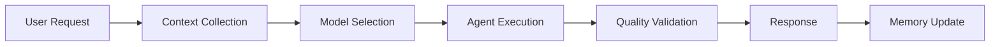

# AI — Map of Content

Every document covering ProjectOne's AI systems, from high-level architecture to individual engineering standards.

> [!info] Looking for AI operating docs instead?
> This MOC covers AI as a **product feature**. For how AI actually does engineering work in this repository — skills, MCP integrations, agents, prompts, workflows, and governing rules — see [[AI Index]] and [[CLAUDE|CLAUDE.md]].

## Product Bible — AI Systems

- [[AI Architecture]] — how AI components communicate and scale
- [[Agent Architecture]] — specialized agent roles and coordination
- [[Memory System]] — conversation, project and preference memory
- [[AI Providers]] — provider-agnostic integration, BYOK, fallback
- [[Workflow Engine]] — orchestration of automated AI processes

## Engineering Handbook

- [[Chapter 08 - AI Engineering Standards]] — prompts, memory, model selection, fallbacks

## Feature Surfaces

- [[AI Chat]] — primary conversational interface
- [[Video Generation]] — AI-driven content pipeline
- [[Analytics]] — AI-generated insights

## AI Request Flow

---

## Navigation

- **Parent:** [[Home]]
- **Related MOCs:** [[Project Bible MOC]] · [[Architecture MOC]] · [[Backend MOC]] · [[AI Index]]
