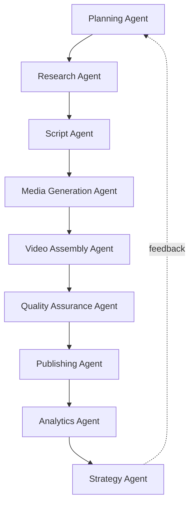

# ProjectOne — 21 Agent Architecture (Draft v0.1)

## Purpose

The Agent Architecture defines how specialized AI agents cooperate to complete complex workflows while remaining modular, transparent and independently scalable.

## Objectives

Assign clear responsibilities to every AI agent, enable collaboration, minimize duplicated work and maintain predictable execution.

## Core Agent Types

Planning Agent, Research Agent, Script Agent, Media Generation Agent, Video Assembly Agent, Quality Assurance Agent, Publishing Agent, Analytics Agent and Strategy Agent.

## Communication Model

Agents exchange structured context, intermediate outputs and execution status through the [[Workflow Engine]] instead of communicating directly.

## Execution Principles

Each agent has a single responsibility, defined inputs and outputs, measurable success criteria and full execution logs.

## Approval Model

Workflows may run fully autonomously or pause for user approval after selected agent stages depending on workspace configuration.

## Success Criteria

New agents can be added, replaced or upgraded without affecting existing workflows or requiring major architectural changes.

---

## Navigation

- **Previous:** [[AI Architecture]]
- **Next:** [[Memory System]]
- **Parent:** [[AI MOC]]
- **Related Notes:** [[AI Architecture]] · [[Workflow Engine]] · [[Video Generation]]
