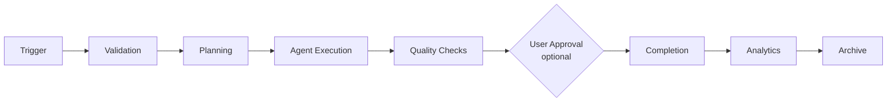

# ProjectOne — 24 Workflow Engine (Draft v0.1)

## Purpose

The Workflow Engine coordinates every automated process inside ProjectOne, ensuring that tasks execute in the correct order with full visibility and reliability.

## Objectives

Orchestrate AI agents, manage dependencies, support parallel execution, recover from failures and provide users with complete workflow transparency.

## Core Capabilities

Workflow creation, execution, scheduling, approvals, checkpoints, retries, branching, notifications and execution history.

## Execution Principles

Every workflow is deterministic, observable, resumable, versioned and independently executable.

## Workflow Lifecycle

Trigger → Validation → Planning → Agent Execution → Quality Checks → User Approval (optional) → Completion → Analytics → Archive.

## Failure Recovery

Failed workflows can pause, retry, resume from checkpoints or terminate safely while preserving execution history.

> [!note] Execution is still synchronous; the substrate for asynchronous execution now exists
> [[STEP-30 Async Job Infrastructure]] delivered the queue, the worker process and the tenant boundary an asynchronous run needs — see [[Async Job Execution]] — and proved them on an infrastructure probe rather than on a workflow. `WorkflowRunner` continues to execute every step inside the request that started it.
>
> **Making runs asynchronous is [[STEP-31 Workflow Async Execution]]**, and the engine needs no change to accept it: state is persisted after each step and `next_step_index` counts only completed steps, so a run identified by its id alone can be continued in a process that did not start it. The queue drives that existing resumability rather than replacing it.
>
> One consequence is already fixed and worth knowing here: an asynchronous run inherits a **third** retry layer, and the composed worst case is **60 upstream provider requests per enqueue** (2 job attempts × 5 chained invocations × 6 requests per completion). Raising any layer means recomputing that product — see [[Async Job Execution#The composed ceiling 60]].

## Success Criteria

Users can automate complex multi-step processes with confidence while understanding exactly what is happening at every stage.

---

## Navigation

- **Previous:** [[AI Providers]]
- **Next:** [[Backend Architecture]]
- **Parent:** [[AI MOC]]
- **Related Notes:** [[Agent Architecture]] · [[Projects]] · [[Video Generation]]
