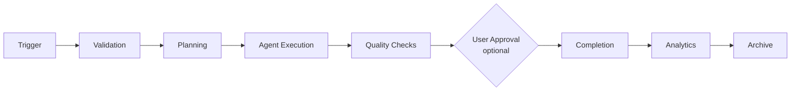

# ProjectOne — 24 Workflow Engine (Draft v0.1)

## Purpose

The Workflow Engine coordinates every automated process inside ProjectOne, ensuring that tasks execute in the correct order with full visibility and reliability.

## Objectives

Orchestrate AI agents, manage dependencies, support parallel execution, recover from failures and provide users with complete workflow transparency.

## Core Capabilities

Workflow creation, execution, scheduling, approvals, checkpoints, retries, branching, notifications and execution history.

## Execution Principles

Every workflow is deterministic, observable, resumable, versioned and independently executable.

## Workflow Lifecycle

Trigger → Validation → Planning → Agent Execution → Quality Checks → User Approval (optional) → Completion → Analytics → Archive.

## Failure Recovery

Failed workflows can pause, retry, resume from checkpoints or terminate safely while preserving execution history.

> [!note] Execution is asynchronous, and recovery from a paid step is a decision rather than a default
> [[STEP-30 Async Job Infrastructure]] built the queue, the worker and the tenant boundary; [[STEP-31 Workflow Async Execution]] moved runs onto them, against the accepted [[ADR-006 Workflow Async Execution and Run Reconciliation]]. Starting a run, approving a step and continuing a stopped run all **enqueue** and answer `202 Accepted`; a client learns the outcome by reading the run.
>
> The queue drives the engine's existing resumability rather than replacing it: state is persisted after each step and `next_step_index` counts only completed steps, so a run identified by its id alone continues in a process that did not start it.
>
> **One thing genuinely changed, and it is what a reader of "resume from checkpoints" needs to know.** Delivery is at-least-once, so two executions of one run can be alive at once — and a step that reaches a paid provider is therefore protected by a durable claim with **no expiry**. Automatic redelivery resumes replayable work; an interrupted paid step **stops and waits for a person**, because a platform that silently re-spends a user's money to avoid showing them a failure has made the user's decision for them. Continuing is one click, and the endpoint says what it may cost.
>
> **There is no exactly-once provider execution.** A provider paid before its worker died is a real, unrecorded charge; nothing re-drives it automatically, and a deliberate recovery may repeat it.
>
> An asynchronous run also inherits a **third** retry layer, and the composed worst case is **60 upstream provider requests per enqueue** (2 job attempts × 5 chained invocations × 6 requests per completion). Raising any layer means recomputing that product — see [[Async Job Execution#The composed ceiling 60]].

## Success Criteria

Users can automate complex multi-step processes with confidence while understanding exactly what is happening at every stage.

---

## Navigation

- **Previous:** [[AI Providers]]
- **Next:** [[Backend Architecture]]
- **Parent:** [[AI MOC]]
- **Related Notes:** [[Agent Architecture]] · [[Projects]] · [[Video Generation]]
