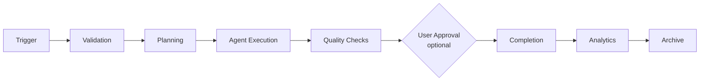

# ProjectOne — 24 Workflow Engine (Draft v0.1)

## Purpose

The Workflow Engine coordinates every automated process inside ProjectOne, ensuring that tasks execute in the correct order with full visibility and reliability.

## Objectives

Orchestrate AI agents, manage dependencies, support parallel execution, recover from failures and provide users with complete workflow transparency.

## Core Capabilities

Workflow creation, execution, scheduling, approvals, checkpoints, retries, branching, notifications and execution history.

## Execution Principles

Every workflow is deterministic, observable, resumable, versioned and independently executable.

## Workflow Lifecycle

Trigger → Validation → Planning → Agent Execution → Quality Checks → User Approval (optional) → Completion → Analytics → Archive.

## Failure Recovery

Failed workflows can pause, retry, resume from checkpoints or terminate safely while preserving execution history.

## Success Criteria

Users can automate complex multi-step processes with confidence while understanding exactly what is happening at every stage.

---

## Navigation

- **Previous:** [[AI Providers]]
- **Next:** [[Backend Architecture]]
- **Parent:** [[AI MOC]]
- **Related Notes:** [[Agent Architecture]] · [[Projects]] · [[Video Generation]]
