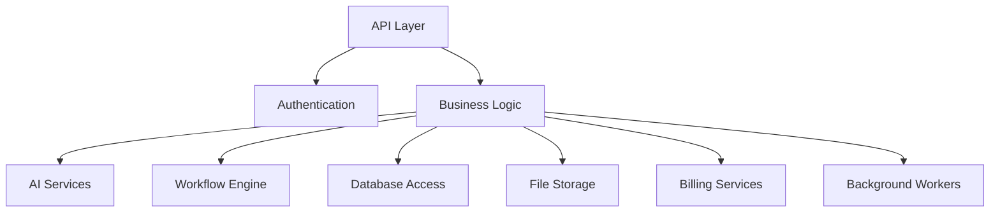

# ProjectOne — 30 Backend Architecture (Draft v0.1)

## Purpose

The Backend Architecture defines the core services that power ProjectOne and expose secure, scalable functionality to every client application.

## Objectives

Provide a modular, secure and scalable backend capable of supporting AI workflows, authentication, storage, billing and integrations.

## Core Components

API Layer, [[Authentication and Authorization|Authentication]], Business Logic, AI Services, [[Workflow Engine]], Database Access, File Storage, Billing Services and Background Workers.

### File Storage

Reached through a **vendor-neutral `StorageProvider` boundary** (`app/storage/`), established by [[STEP-27 Storage Provider Abstraction]] under [[ADR-004 Object Storage Provider and Tenant-Safe Key Construction]]. Cloudflare R2 is the initial adapter, via its S3-compatible API; no code above `app/storage/providers/` knows which vendor is in use, and an executable test (`tests/test_storage_boundary.py`) fails the build if a vendor SDK is imported above that line.

Four operations only — put, get, signed URL, delete. No listing, no multipart upload, no copy/move: the same restraint the [[AI Providers|AI provider interface]] was built with, for the same reason.

> [!warning] Object storage has no Row Level Security
> Everywhere else the workspace boundary is enforced by the database, so a repository that forgot to filter is still safe. **Object storage has no equivalent.** The object-key convention *is* the tenant boundary.
>
> Two rules follow, and neither is optional: **callers never supply a path** (every operation takes a workspace id and a logical name, and `app/storage/keys.py` is the only key constructor), and the workspace prefix is **delimiter-terminated** (`ws/<uuid>/`) so one workspace's namespace can never textually prefix another's.

**What is persisted is a locator, not a key.** `put` returns `StoredObject.locator` — the logical name — and that is what `assets.storage_path` stores, beside the `workspace_id` already on the row. Retrieval passes both back unchanged. Persisting the constructed key would have forced the reading code to parse it back into a logical name, returning caller-side raw-path handling through the database and recording one backend's addressing scheme in a column that outlives it.

## Architecture Principles

Modular services, stateless APIs where possible, event-driven processing, fault tolerance, observability and horizontal scalability.

See also: [[FastAPI Architecture]]

## Responsibilities

Validate requests, enforce permissions, orchestrate workflows, manage data, integrate external services and expose consistent APIs.

## Success Criteria

The backend remains reliable, maintainable and independently scalable as ProjectOne grows.

---

## Navigation

- **Previous:** [[Workflow Engine]]
- **Next:** [[Database Architecture]]
- **Parent:** [[Backend MOC]]
- **Related Notes:** [[Database Architecture]] · [[API Architecture]] · [[FastAPI Architecture]] · [[Infrastructure]]
