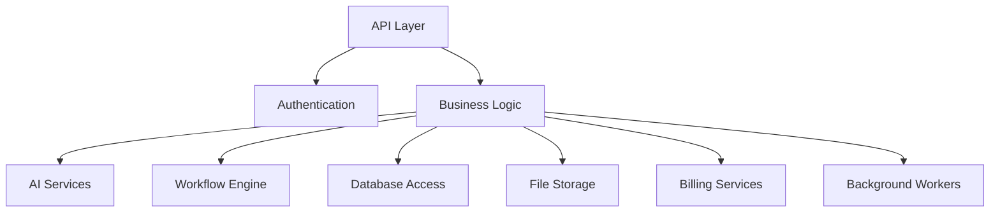

# ProjectOne — 30 Backend Architecture (Draft v0.1)

## Purpose

The Backend Architecture defines the core services that power ProjectOne and expose secure, scalable functionality to every client application.

## Objectives

Provide a modular, secure and scalable backend capable of supporting AI workflows, authentication, storage, billing and integrations.

## Core Components

API Layer, [[Authentication and Authorization|Authentication]], Business Logic, AI Services, [[Workflow Engine]], Database Access, File Storage, Billing Services and Background Workers.

## Architecture Principles

Modular services, stateless APIs where possible, event-driven processing, fault tolerance, observability and horizontal scalability.

See also: [[FastAPI Architecture]]

## Responsibilities

Validate requests, enforce permissions, orchestrate workflows, manage data, integrate external services and expose consistent APIs.

## Success Criteria

The backend remains reliable, maintainable and independently scalable as ProjectOne grows.

---

## Navigation

- **Previous:** [[Workflow Engine]]
- **Next:** [[Database Architecture]]
- **Parent:** [[Backend MOC]]
- **Related Notes:** [[Database Architecture]] · [[API Architecture]] · [[FastAPI Architecture]] · [[Infrastructure]]
