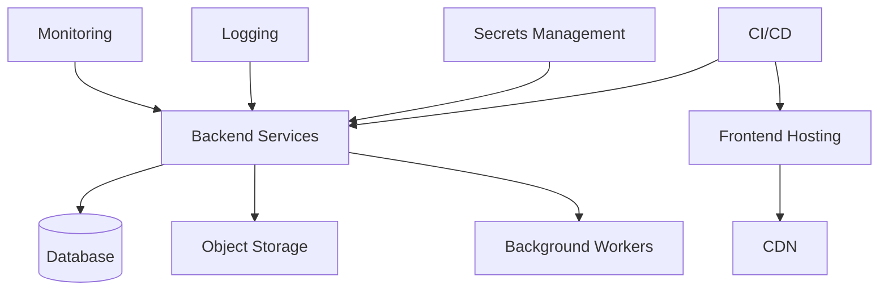

# ProjectOne — 34 Infrastructure (Draft v0.1)

## Purpose

The Infrastructure defines the cloud foundation that hosts, secures, deploys and operates every ProjectOne service.

## Objectives

Provide a reliable, scalable and secure environment capable of supporting continuous delivery and future growth.

## Core Components

Frontend Hosting, Backend Services, Database, Object Storage, CDN, Background Workers, Monitoring, Logging, Secrets Management and CI/CD.

## Infrastructure Principles

Cloud-first, infrastructure as code, high availability, automated deployments, observability, disaster recovery and cost awareness.

See also: [[Backup and Disaster Recovery]] · [[Deployment Strategy]]

## Operational Requirements

Automated backups, health monitoring, alerting, rollback capability, environment isolation and secure secret management.

## Success Criteria

ProjectOne infrastructure remains secure, resilient and scalable while allowing rapid iteration with minimal operational overhead.

---

## Navigation

- **Previous:** [[Frontend Architecture]]
- **Next:** [[Roadmap]]
- **Parent:** [[Architecture MOC]]
- **Related Notes:** [[Deployment Strategy]] · [[Backup and Disaster Recovery]] · [[Backend Architecture]]
