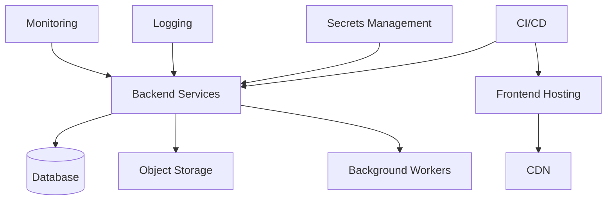

# ProjectOne — 34 Infrastructure (Draft v0.1)

## Purpose

The Infrastructure defines the cloud foundation that hosts, secures, deploys and operates every ProjectOne service.

## Objectives

Provide a reliable, scalable and secure environment capable of supporting continuous delivery and future growth.

## Core Components

Frontend Hosting, Backend Services, Database, Object Storage, CDN, Background Workers, Monitoring, Logging, Secrets Management and CI/CD.

### Background Workers exist as of [[STEP-30 Async Job Infrastructure]]

The component named above is now built, and the shape it took is narrower than "a worker tier": **one image, two processes** — the API under `uvicorn`, the worker under `python -m app.jobs.worker`, from the same package and the same validated configuration ([[ADR-005 Async Job Queue and Worker Execution Model]] §3).

There is **no separate queue service**. The queue is a table in the primary PostgreSQL database, claimed with `SELECT ... FOR UPDATE SKIP LOCKED`, which is why "Background Workers" adds a process to this diagram and not a box beside the database. See [[Async Job Execution]].

The repository's `infrastructure/` directory exists from this step, holding the process model — what each process requires, and how each is started and stopped. **Which platform runs them is deferred to [[STEP-82 Staging Environment and Deployment Pipeline]]** by owner decision on 2026-08-17, along with worker autoscaling. What STEP-30 guarantees is that both processes fail at deploy rather than at a user's first request: they validate the same configuration with the same strictness, object storage included.

> [!warning] Worker liveness is a monitoring requirement, and it is not yet met
> A worker that is not running logs nothing — a platform where nothing finishes and nothing errors, which is [[CLAUDE|CLAUDE.md]] §26's central case. Its in-process sibling is closed (ten consecutive dispatch failures stop the process loudly), but external liveness monitoring is owed by [[STEP-81 Observability and Alerting]] and is a stated gap until then.

## Infrastructure Principles

Cloud-first, infrastructure as code, high availability, automated deployments, observability, disaster recovery and cost awareness.

See also: [[Backup and Disaster Recovery]] · [[Deployment Strategy]]

## Operational Requirements

Automated backups, health monitoring, alerting, rollback capability, environment isolation and secure secret management.

### Reverse proxy configuration (binding, from [[ADR-002 Trusted Proxy and Client Address Resolution]])

The rest of this note is a v0.1 specification of intent. This subsection is not — it records a requirement that already binds every environment, added by [[STEP-12a Trusted Proxy and Per-User Rate Limiting]].

The API rate limits public endpoints (sign-in, sign-up, refresh) by client address, and every browser call reaches it through the Next.js proxy. **Two things must hold in every environment**, or one user's requests lock out all the others:

1. **Every proxy in front of the API is listed in `PROJECTONE_TRUSTED_PROXIES`** (CIDR ranges or bare addresses). If the Next.js server is missing from it, the forwarded address is ignored and the whole platform shares one rate-limit bucket — the exact regression STEP-16 introduced and STEP-12a fixed. The API warns at startup when the allowlist is empty; it does not warn when the allowlist is merely *wrong*, so this is a deployment checklist item.
2. **Every trusted proxy strips or overwrites an inbound `X-Forwarded-For` from the internet rather than appending to it.** A proxy that blindly appends splices attacker-supplied entries into a chain the API is about to trust. The API's right-to-left parsing limits the damage, but the proxy is the correct place to stop it.

Behind Cloudflare, the allowlist must include Cloudflare's published ranges **plus** any proxy of your own, and those ranges change — re-check on deploy. `PROJECTONE_CLIENT_ADDRESS_HEADER=CF-Connecting-IP` may then be set, which is honoured only from an already-trusted peer.

Full reasoning, including the failure modes each rule prevents, is in the ADR. `apps/api/.env.example` carries the operational detail.

## Success Criteria

ProjectOne infrastructure remains secure, resilient and scalable while allowing rapid iteration with minimal operational overhead.

---

## Navigation

- **Previous:** [[Frontend Architecture]]
- **Next:** [[Roadmap]]
- **Parent:** [[Architecture MOC]]
- **Related Notes:** [[Deployment Strategy]] · [[Backup and Disaster Recovery]] · [[Backend Architecture]]
