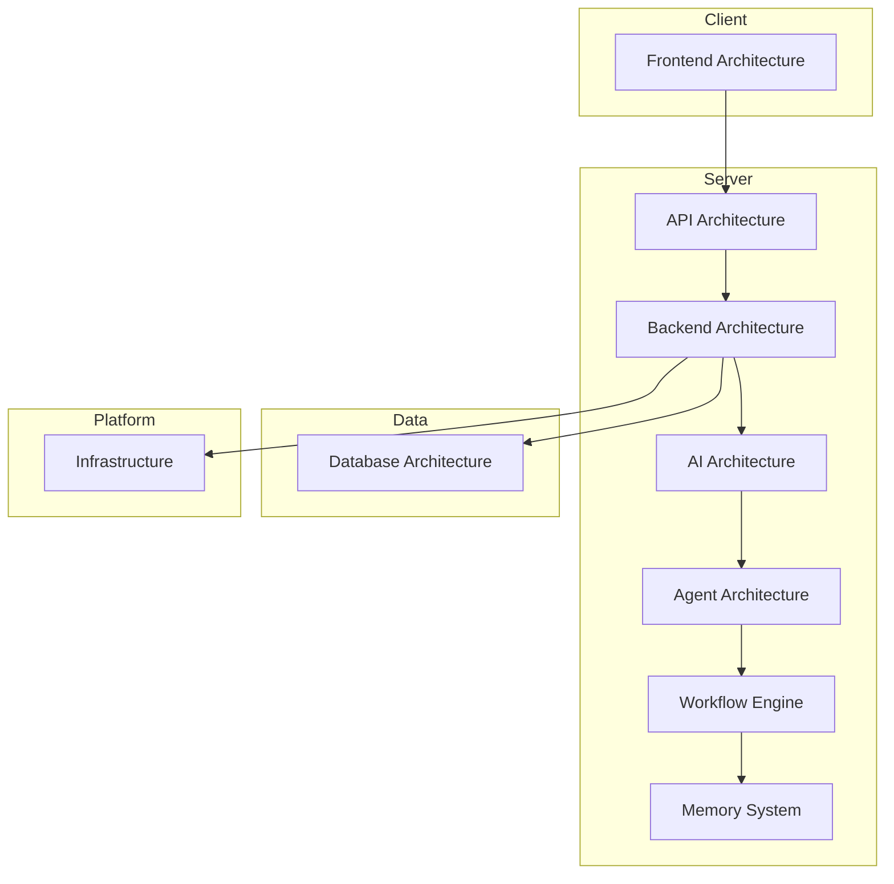

# Architecture — Map of Content

Cross-cutting view of every architectural document in the vault, spanning product-level AI systems, backend, frontend, database and infrastructure.

## System Map

## AI Systems

- [[AI Architecture]]
- [[Agent Architecture]]
- [[Memory System]]
- [[AI Providers]]
- [[Workflow Engine]]

See also: [[AI MOC]]

## Backend

- [[Backend Architecture]]
- [[API Architecture]]
- [[Chapter 06 - FastAPI Architecture]]

Implemented (as opposed to intended model):

- [[Authentication Implementation]]
- [[Authorization Model]]
- [[API Conventions]]
- [[API Endpoints]]
- [[AI Router Implementation]]
- [[AI Cost Governance]]
- [[Project Lifecycle]]
- [[Workflow Execution]]
- [[Async Job Execution]]

See also: [[Backend MOC]]

## Frontend

- [[Frontend Architecture]]
- [[Design System]]
- [[Chapter 04 - React Standards]]
- [[Chapter 05 - NextJS Architecture]]

Implemented (as opposed to intended model):

- [[Web Session Handling]]

See also: [[Frontend MOC]]

## Database

- [[Database Architecture]]
- [[Chapter 07 - Database Standards]]

Implemented schema (as opposed to intended model):

- [[Schema Overview]]
- [[Table Conventions]]
- [[RLS Policy Pattern]]
- [[Table - users]] · [[Table - workspaces]] · [[Table - workspace_members]] · [[Table - audit_log]] · [[Table - security_event_log]] · [[Table - provider_credentials]] · [[Table - ai_spend_records]] · [[Table - ai_budgets]] · [[Table - ai_shutdown_switches]] · [[Table - projects]] · [[Table - assets]] · [[Table - workflow_runs]] · [[Table - jobs]]

See also: [[Database MOC]]

## Infrastructure & Delivery

- [[Infrastructure]]
- [[Deployment Strategy]]
- [[Backup and Disaster Recovery]]

---

## Navigation

- **Parent:** [[Home]]
- **Related MOCs:** [[AI MOC]] · [[Backend MOC]] · [[Frontend MOC]] · [[Database MOC]] · [[Security MOC]]
