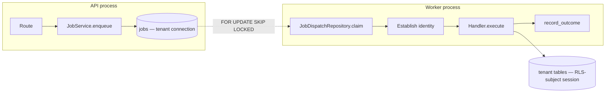

# Async Job Execution

**How work outlives the request that started it.** Built by [[STEP-30 Async Job Infrastructure]] against [[ADR-005 Async Job Queue and Worker Execution Model]], which the project owner accepted on 2026-08-17.

This note describes **what exists**. [[ADR-005 Async Job Queue and Worker Execution Model]] records why each choice was made and what was rejected; [[Table - jobs]] describes the schema. If this note and the ADR disagree, the ADR is the decision and this note is the drift.

## What it replaces

`WorkflowRunner` executed every step inside the HTTP request that started it, so a multi-minute render could not be a workflow: the browser would wait for it, and any timeout between the client and the API would abandon a run that was still spending money. [[Product Coverage Audit]] recorded background execution as the second-largest foundation gap.

> [!note] STEP-30 ships the substrate, not the integration
> Workflow runs are **still synchronous**. This step delivers the queue, the worker and the tenant boundary, and proves them on a trivial handler; making workflow runs asynchronous is [[STEP-31 Workflow Async Execution]].

## The shape

**One image, two processes** — see `infrastructure/process-model.md`. The worker runs `python -m app.jobs.worker` from the same package and the same `Settings` as the API, so a worker cannot be started with configuration the API has never seen.

## The queue is a table

Jobs are rows in `public.jobs` in the primary Supabase database, claimed with `SELECT ... FOR UPDATE SKIP LOCKED`. No broker, no new dependency, no new credential class.

The property that decided it is **transactional enqueue**: a job is written in the same transaction as the row that motivates it, so a workflow run and its job commit together or neither exists. Every external broker breaks that, and repairing it requires an outbox — which is a PostgreSQL-backed queue with extra steps.

**Polling, not push.** Latency is bounded by `PROJECTONE_JOB_POLL_INTERVAL_SECONDS`, which is configuration rather than code. `LISTEN`/`NOTIFY` is deliberately not adopted: it is an optimization, nothing has measured the poll interval as mattering, and [[CLAUDE|CLAUDE.md]] §17 requires measurement before optimization. Adopting it later changes latency, not architecture, so it needs no superseding ADR.

## Delivery is at-least-once, and every handler must survive it

A claimed job holds a **lease**. A worker executing a long job extends it on a background heartbeat; a worker that dies stops extending, and the job becomes claimable again once the lease lapses.

That has one unavoidable consequence, stated plainly rather than glossed: **the job becomes claimable while the original worker may still be running it.** Exactly-once is not achievable without distributed consensus.

> [!important] The handler obligation is a rule, not a hope
> **Duplicate delivery must not duplicate effects.** For work whose state lives in PostgreSQL this is usually close to free. **It is not free for any handler with an external side effect**: a duplicate that reaches an AI provider is charged twice, and deduplicating the stored result afterwards prevents a duplicate row and never a duplicate bill (`c8f1a3d54e29` is the binding precedent).
>
> A handler performing a non-idempotent external action must guard it with its own durable claim. **The job lease is not a substitute for one**, because the lease can lapse under a worker that is still running.

The guarantee is stated in `app/jobs/contract.py`'s own docstring, and `test_the_contract_docstring_states_the_delivery_guarantee` keeps it there — a handler author who has to infer the delivery guarantee will infer the convenient one.

## Tenancy: the worker replays the enqueuing user

RLS resolves through `auth.uid()` and `workspace_members`, and a worker has no request. So the job carries the id of the user who enqueued it, and the worker calls the existing `RequestSessionFactory.authenticated_as(user_id)` — the same code path a request uses.

**The workspace id on the job is attribution, not security.** What makes execution safe is the user identity replayed through RLS.

Four consequences, all intended:

- **A handler never receives a privileged connection.** It gets `JobContext.tenant_session()`, a factory opening RLS-subject sessions. There is no "the worker is internal so it can use elevated access" path.
- **A missed role switch fails closed in the worker too**, because `projectone_api` is `NOINHERIT` — the failure mode of forgetting is reading *nothing*.
- **A job whose actor lost membership fails terminally**, before any handler runs.
- **The transaction structure follows from the claim committing first**: the long work executes with no transaction open and no row locked, and the handler opens short, discrete sessions per unit of database work.

### The ordering guarantee, and how it is met

ADR-005 §5 constraint 4 requires the user's RLS context to be established *before execution begins*, as an ordering guarantee rather than an available mechanism. ADR-005 §4 separately forbids holding one transaction open across a multi-minute handler.

Both are met, and the reconciliation is worth stating because the two read as being in tension:

1. The worker opens an RLS-subject session and **proves** the identity — it asks the database for the actor's live role in the job's workspace, through the same policies the handler's own queries will meet. A revoked member reads nothing, which is the answer.
2. That session closes.
3. The handler is invoked with a *factory*, and every session it opens is RLS-subject as the same user.

So identity is established and verified before the handler's first statement, and no transaction is held while the long work runs. `test_identity_is_established_before_the_handler_runs` asserts the ordering structurally; `test_a_revoked_membership_fails_terminally_without_reaching_the_handler` asserts the behaviour against a real database.

## The one cross-tenant path

There is exactly one irreducible cross-tenant operation in any queue: **a worker must find the next job before it knows whose job it is.** The dispatch query cannot be RLS-scoped, because the identity that would scope it is the answer the query returns.

`app/repositories/job_dispatch.py` is that path, and it is bounded by six constraints (ADR-005 §5):

| # | Constraint | Proven by |
|---|---|---|
| 1 | One table: `public.jobs`, never joined to a tenant table | `test_no_statement_mentions_a_tenant_table` |
| 2 | Three operations, not a connection handed out | Module surface |
| 3 | No privileged connection passed to, reachable from, or held open during a handler | `test_the_claim_carries_no_connection`, `test_the_handler_context_exposes_only_a_tenant_session` |
| 4 | The user's RLS context is established before execution begins | `test_identity_is_established_before_the_handler_runs` |
| 5 | Every claim is logged | `job_claimed`, with job, type, workspace, worker and correlation id |
| 6 | The `jobs` table still carries RLS | Migration `a1b7c3e94f6d` |

**Constraints 1, 3 and 4 are proven by test because the ADR requires it**: a boundary asserted only in prose is one the next handler's author can cross without noticing.

## Retries: classified, then counted

Not every failure deserves a retry, and retrying the wrong one spends money on a settled "no".

| Class | Examples | Behaviour |
|---|---|---|
| **Terminal** | Every `GovernanceError`, every `AuthorizationError` (including revoked membership), every `WorkflowError`, an unregistered job type | Dead-lettered immediately, however many attempts remain |
| **Retryable** | Transient infrastructure failures, unexpected exceptions, lease recoveries | Retried to the ceiling, then dead-lettered |

This mirrors the `RetryableProviderError` / `TerminalProviderError` split `AIRouter` applies one layer down. Note that a `TerminalProviderError` is **not** terminal at the job layer: terminal to the router means "do not try this provider again with this request", and the router still falls back.

**Handlers declare their ceiling explicitly.** `max_attempts` is abstract on `JobHandler`, so there is no default a handler author can ship without considering — an omitted ceiling fails at import, not as a job that quietly retries forever.

## The composed ceiling: 60

Three retry layers now exist, and §15a's worst case is reached not by anyone removing a limit but by three reasonable limits multiplying.

| Layer | Ceiling | Source |
|---|---|---|
| Provider attempts per provider | 3 | `DEFAULT_MAX_ATTEMPTS_PER_PROVIDER` |
| Providers in the fallback chain | 2 | `DEFAULT_MAX_PROVIDERS_TRIED` |
| → upstream requests per `complete()` | **6** | [[STEP-17 AI Router and Provider Abstraction]] |
| Chained AI invocations per run execution | 5 | `DEFAULT_MAX_CHAINED_INVOCATIONS` |
| → upstream requests per run execution | **30** | 5 × 6 |
| Job attempts per enqueue | **2** | Set by the project owner, 2026-08-17 |
| → **upstream requests per enqueue** | **60** | 2 × 5 × 6 |

`MAX_UPSTREAM_REQUESTS_PER_ENQUEUE` is **computed from its factors**, not written as 60, so raising any layer moves it. `ck_jobs_max_attempts_within_ceiling` enforces the same bound in the database, because a job row is what actually costs money.

Two adjacent bounds hold independently and are not multiplied away: `ExecutionBudget`'s 300-second and 500,000-token limits per run execution, and `AISpendService`'s per-workspace spend ceiling. **The retry ceiling bounds wasted work; the spend ceiling bounds cost.**

## Observability

| Event | When |
|---|---|
| `job_enqueued` | A job is queued |
| `job_claimed` | A worker takes it — the audited claim (§5 constraint 5) |
| `job_succeeded` | With its duration |
| `job_retry_scheduled` | A retryable failure with attempts remaining |
| `job_dead_lettered` | Terminal refusal, attempts exhausted, or reaped |
| `job_outcome_discarded` | A worker settled a job whose lease it had lost — expected, not an error |
| `job_lease_lost` / `job_lease_extension_failed` | The heartbeat stopped |
| `job_crashed` | An unexpected exception, with its traceback |
| `job_worker_started` / `job_worker_stopped` / `job_dispatch_failed` | Process lifecycle |

**Correlation ids travel.** The enqueuing request's `X-Request-ID` is stored on the job and bound into the worker's logging context while it runs, so every line — including a handler's own — carries the id of the request that caused it. Without it an async failure cannot be traced back to what caused it.

**A job's state is inspectable without a debugger**: status, attempts, last error, dead-letter timestamp and result are columns, readable by the owning workspace through RLS.

> [!warning] A worker that is not running logs nothing
> The one failure mode this design cannot close on its own: a platform where nothing finishes and nothing errors. **Worker liveness is a monitoring requirement**, recorded in `infrastructure/process-model.md` and owned by [[STEP-81 Observability and Alerting]]. Until then it is a stated gap, not an assumption.
>
> Its in-process sibling *is* closed: ten consecutive dispatch failures stop the worker with a non-zero exit, so a worker whose database is gone dies loudly rather than polling forever while looking alive.

## What is deliberately not here

- **Workflow integration** — [[STEP-31 Workflow Async Execution]].
- **Scheduling, cron, delayed execution, and jobs with no user** — [[STEP-74 Workflow Scheduling and Triggers]], which owns the system-actor decision ADR-005 §4 deferred. Every job today originates from an authenticated request, so an enqueuing user always exists; inventing a service identity before there is a caller to shape it would create the platform's most privileged principal by guesswork.
- **Hosting, orchestration and worker autoscaling** — [[STEP-82 Staging Environment and Deployment Pipeline]] by owner decision. The *process model* is settled and recorded.
- **Notification of job completion** — [[STEP-34 Notifications Domain]] onward. A user watching a job finish is a different problem from a job finishing.
- **Provider-side idempotency keys.** The exactly-once problem `c8f1a3d54e29` names as unachievable without them remains open, and is a capability-layer decision rather than a queue one.

---

## Navigation

- **Previous:** [[Workflow Execution]]
- **Next:** [[AI Cost Governance]]
- **Parent:** [[Architecture MOC]]
- **Related Notes:** [[ADR-005 Async Job Queue and Worker Execution Model]] · [[Table - jobs]] · [[Workflow Execution]] · [[Workflow Engine]] · [[Infrastructure]] · [[AI Cost Governance]] · [[RLS Policy Pattern]] · [[STEP-30 Async Job Infrastructure]]
