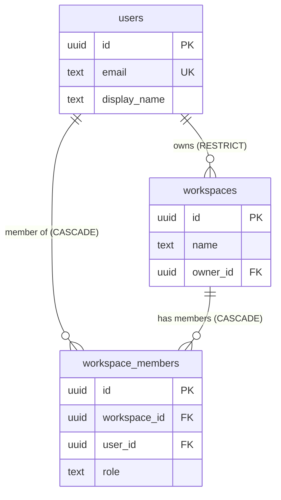

# Schema Overview

The tables that actually exist in ProjectOne's database right now, and the migrations that created them. This note describes **implemented schema**; [[Database Architecture]] describes the intended data model across all planned domains.

If the two disagree, this note describes reality and the other describes intent — neither is wrong, but only this one tells you what a query will find.

## Current Tables

As of [[STEP-09 Row Level Security Policies]]:

| Table | Purpose | Tenant-scoped | RLS |
|---|---|---|---|
| [[Table - users]] | Application-side profile, keyed to Supabase Auth identity | No | ✅ Enabled + forced |
| [[Table - workspaces]] | The tenant boundary | Is the boundary | ✅ Enabled + forced |
| [[Table - workspace_members]] | User ↔ workspace membership with role | Yes | ✅ Enabled + forced |

`alembic_version` also exists — Alembic's own migration tracking table, not application schema.

Every table also carries `created_at`, `updated_at`, `deleted_at` and `version` — see [[Table Conventions]].

## Migration History

Applied in order. History is append-only: a correction is a new migration, never an edit to an applied file.

| Revision | Description | Step |
|---|---|---|
| `e37e521504a3` | Create the throwaway `migration_pipeline_check` table, proving the pipeline works | [[STEP-07 Supabase Provisioning]] |
| `4c310926e967` | Drop `migration_pipeline_check` — it carried no application meaning | [[STEP-08 Users and Workspaces Schema]] |
| `8a6f39b07c12` | Create `users`, `workspaces`, `workspace_members`, plus the `touch_row` trigger function | [[STEP-08 Users and Workspaces Schema]] |
| `860a798d204b` | Enable and force RLS on all three tables, add the membership helper and eight policies | [[STEP-09 Row Level Security Policies]] |
| `c4f21a86b3de` | Narrow table grants to `SELECT/INSERT/UPDATE` for `authenticated`, nothing for `anon`, and correct the schema's default privileges so future tables inherit the same | [[STEP-10 Authentication Backend]] |
| `d7b95c1f4e08` | Create `projectone_api`, the request-path role that does **not** bypass RLS | [[STEP-10 Authentication Backend]] |

Apply with `./scripts/migrate.sh up` (or `.\scripts\migrate.ps1 up`); see `scripts/README.md`.

## Database Objects Beyond Tables

| Object | Type | Purpose |
|---|---|---|
| `touch_row()` | Function (plpgsql) | Maintains `updated_at` and `version` on update — see [[Table Conventions#The touch_row Trigger]] |
| `app_current_user_workspaces()` | Function (sql, SECURITY DEFINER) | Returns the workspace ids the caller belongs to, read outside RLS to break policy recursion — see [[RLS Policy Pattern#The Membership Function]] |
| `trg_users_touch_row` | Trigger | Attaches `touch_row()` to `users` |
| `trg_workspaces_touch_row` | Trigger | Attaches `touch_row()` to `workspaces` |
| `trg_workspace_members_touch_row` | Trigger | Attaches `touch_row()` to `workspace_members` |

## Roles

| Role | Bypasses RLS | Used by |
|---|---|---|
| `postgres` | **Yes** (`rolbypassrls` + `rolsuper`) | Alembic migrations only — `DATABASE_URL` |
| `projectone_api` | No | Every API request — `REQUEST_DATABASE_URL` |
| `service_role` | **Yes** (`rolbypassrls`) | Nothing on the request path |

`postgres` and `service_role` bypassing RLS is not fixable in a migration; the control is architectural, and [[STEP-10 Authentication Backend]] resolved it by giving the request path its own non-bypassing role. See [[RLS Policy Pattern#The Two Connections]].

## Outstanding

- **Roles have no meaning yet.** `workspace_members.role` fixes a vocabulary; what each role permits is [[STEP-11 Authorization and RBAC]].
- **Workspace creation has no service path.** The INSERT policies deliberately cannot bootstrap a workspace and its first membership row from a client — [[STEP-13 Auth Users Workspaces Endpoints]] owns the audited path.
- **`supabase_admin`'s default privileges are untouched.** `postgres` cannot alter them (it is not a superuser on managed Supabase). They govern tables Supabase creates, not ProjectOne's — see [[RLS Policy Pattern#Grants Are a Second, Independent Gate]].
- **No ORM.** Migrations are hand-written SQL through Alembic's `op` API. Adopting an ORM would be an ADR ([[08 ADR]]), not a quiet change.

---

## Navigation

- **Previous:** [[Authorization Model]]
- **Next:** [[Table - users]]
- **Parent:** [[Database MOC]]
- **Related Notes:** [[Table Conventions]] · [[RLS Policy Pattern]] · [[Table - users]] · [[Table - workspaces]] · [[Table - workspace_members]] · [[Database Architecture]] · [[Chapter 07 - Database Standards]]
