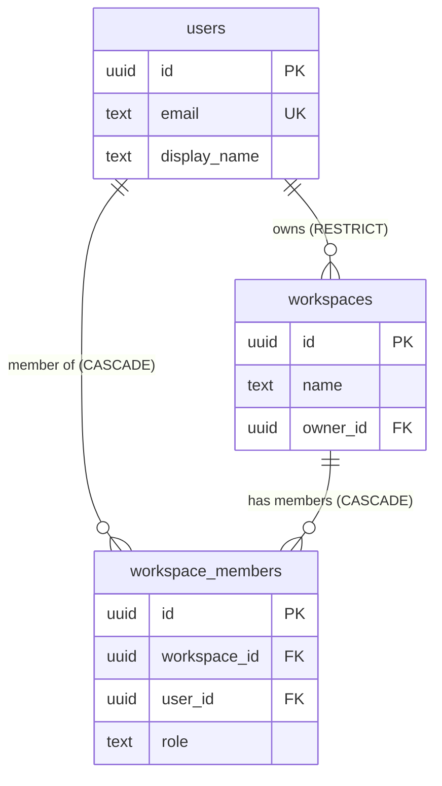

# Schema Overview

The tables that actually exist in ProjectOne's database right now, and the migrations that created them. This note describes **implemented schema**; [[Database Architecture]] describes the intended data model across all planned domains.

If the two disagree, this note describes reality and the other describes intent — neither is wrong, but only this one tells you what a query will find.

## Current Tables

As of [[STEP-08 Users and Workspaces Schema]]:

| Table | Purpose | Tenant-scoped | RLS |
|---|---|---|---|
| [[Table - users]] | Application-side profile, keyed to Supabase Auth identity | No | ⚠️ Pending STEP-09 |
| [[Table - workspaces]] | The tenant boundary | Is the boundary | ⚠️ Pending STEP-09 |
| [[Table - workspace_members]] | User ↔ workspace membership with role | Yes | ⚠️ Pending STEP-09 |

`alembic_version` also exists — Alembic's own migration tracking table, not application schema.

Every table also carries `created_at`, `updated_at`, `deleted_at` and `version` — see [[Table Conventions]].

## Migration History

Applied in order. History is append-only: a correction is a new migration, never an edit to an applied file.

| Revision | Description | Step |
|---|---|---|
| `e37e521504a3` | Create the throwaway `migration_pipeline_check` table, proving the pipeline works | [[STEP-07 Supabase Provisioning]] |
| `4c310926e967` | Drop `migration_pipeline_check` — it carried no application meaning | [[STEP-08 Users and Workspaces Schema]] |
| `8a6f39b07c12` | Create `users`, `workspaces`, `workspace_members`, plus the `touch_row` trigger function | [[STEP-08 Users and Workspaces Schema]] |

Apply with `./scripts/migrate.sh up` (or `.\scripts\migrate.ps1 up`); see `scripts/README.md`.

## Database Objects Beyond Tables

| Object | Type | Purpose |
|---|---|---|
| `touch_row()` | Function (plpgsql) | Maintains `updated_at` and `version` on update — see [[Table Conventions#The touch_row Trigger]] |
| `trg_users_touch_row` | Trigger | Attaches `touch_row()` to `users` |
| `trg_workspaces_touch_row` | Trigger | Attaches `touch_row()` to `workspaces` |
| `trg_workspace_members_touch_row` | Trigger | Attaches `touch_row()` to `workspace_members` |

## Outstanding

> [!warning] RLS is not yet enabled on any table
> [[STEP-09 Row Level Security Policies]] enables it. Until that step is `Done`, **no application code reads or writes these tables** — they hold no data, and the gap is a deliberate sequencing choice, not an oversight ([[Table Conventions#Row Level Security]]).

- **No link enforced to `auth.users`.** `users.id` carries the same value as Supabase Auth's identity, but no foreign key exists — see [[Table - users#Relationship to Supabase Auth]]. [[STEP-10 Authentication Backend]] owns this.
- **Roles have no meaning yet.** `workspace_members.role` fixes a vocabulary; what each role permits is [[STEP-11 Authorization and RBAC]].
- **No ORM.** Migrations are hand-written SQL through Alembic's `op` API. Adopting an ORM would be an ADR ([[08 ADR]]), not a quiet change.

---

## Navigation

- **Previous:** [[Table Conventions]]
- **Next:** [[Table - users]]
- **Parent:** [[Database MOC]]
- **Related Notes:** [[Table Conventions]] · [[Table - users]] · [[Table - workspaces]] · [[Table - workspace_members]] · [[Database Architecture]] · [[Chapter 07 - Database Standards]]
