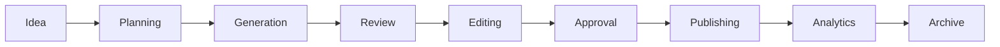

# Features — Map of Content

Every user-facing functional area of ProjectOne, as defined by the Product Bible.

## Core Product

- [[Product Bible]] — parent specification
- [[Dashboard]] — home page and overview
- [[Projects]] — central content workspace
- [[AI Chat]] — conversational interface
- [[Video Generation]] — idea-to-video pipeline
- [[Analytics]] — performance insights
- [[Billing]] — subscriptions and usage
- [[Settings]] — account and workspace configuration

## Design

- [[Design System]] — visual language governing every feature's UI

## Feature Lifecycle Reference

(as defined in [[Projects]])

---

## Navigation

- **Parent:** [[Home]]
- **Related MOCs:** [[Project Bible MOC]] · [[AI MOC]] · [[Design MOC]]
