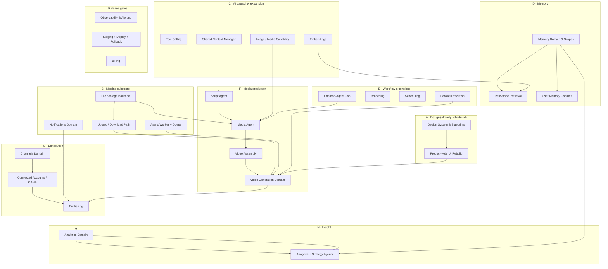

# Product Coverage Audit

The complete intended ProjectOne product, compared against the implementation that actually exists on `main`.

**Verified against `main` at `5757f81`** (`docs(step-25a): mark the step Done and record the merged state`), confirmed identical to `origin/main` with a clean working tree on 2026-08-15. Nothing here was inferred from a filename: every "Implemented" verdict names the module, route or migration that carries the behaviour, and every implementation claim was read in source.

> [!important] What this document is, and is not
> **This is an audit record, not a plan.** It changes no step, renumbers nothing, and schedules nothing. It exists to inform one separate owner decision: how to rebuild and renumber the roadmap from STEP-26 onward.
>
> It also **implements nothing**. No product code was written, no migration was added, and the shared Supabase project was never connected to, read from, or written to.
>
> Where a canonical source and the current [[Build Plan]] disagree, this audit follows the source — [[CLAUDE|CLAUDE.md]]'s source-of-truth hierarchy puts the Project Bible above a planning document.

> [!note] Acted on 2026-08-15
> The owner decision this audit was written to inform has been taken. The [[Build Plan]] was rebuilt from STEP-26 to **STEP-89** — 64 steps in fourteen phases — and every P0/P1 gap recorded below now has an executable step, or appears in [[Build Plan#Deferred by Decision]] with its reason. **The findings below are unchanged**: this is a record of what was true at `5757f81`, not a live tracker.

## Summary

| Status | Count |
|---|---|
| **Implemented** | 21 |
| **Foundation / Partial** | 14 |
| **Missing** | 24 |
| **Intentionally Deferred** | 5 |
| **Documentation Drift** | 4 |
| **Total capabilities assessed** | **68** |

**The Foundation is real and the product is not yet.** What exists is a well-built platform substrate — identity, tenancy, RLS, authorization, AI routing with BYOK and governance, projects, a workflow engine, chat, a dashboard — carrying 40 test files and a green pipeline. What does not exist is most of the *product* the Project Bible describes: the vault specifies eight core pillars ([[Product Bible]]) and the implementation delivers roughly two and a half of them.

**The single largest gap is not a feature, it is a substrate.** [[Video Generation]], the asset lifecycle, publishing and the media agent chain all sit behind one absent capability: **there is no file storage backend**. `assets.storage_path` exists as a nullable column and is null on every row any route can create (`apps/api/app/routers/projects.py:354`). No bytes cross the system today.

**Three planning gaps matter more than the feature gaps.** Storage, the AI capability model beyond chat completion, and the Memory System have **no executable build step anywhere** — not in the remaining plan, not deferred with a reason. They are absent rather than scheduled, and every media, agent and personalisation capability depends on at least one of them.

### Where the eight product pillars stand

[[Product Bible]] names eight pillars. Measured against implementation:

| Pillar | State |
|---|---|
| **AI Generation** | Partial — text completion only; no media of any kind |
| **AI Agents** | Foundation — 1 of 9 specified agents exists |
| **Automation** | Foundation — linear runs only; no scheduling, branching or triggers |
| **Analytics** | Missing — no events, no metrics, no domain |
| **Memory** | Foundation — 1 of 5 scopes, bounded and non-inspectable |
| **Multi-Platform Publishing** | Missing — no channels, no connected accounts, no publishing path |
| **Collaboration** | Foundation — RBAC and memberships exist; no collaborative surface |
| **Continuous Optimization** | Missing — depends on Analytics, which does not exist |

---

## Coverage Matrix

Priorities are **P0** prerequisite · **P1** core product · **P2** productivity/expansion · **P3** scale/later. Planning state is **has step** (an executable step exists) · **future phase** (named only in a Roadmap phase or a step's out-of-scope note) · **no step** (a genuine planning gap).

### Domain: Identity, Tenancy & Access

| Capability | Canonical source | Implementation evidence | Status | What is missing | Priority | Dependencies | Release relevance | Planning state |
|---|---|---|---|---|---|---|---|---|
| Email/password authentication | [[Authentication and Authorization]], [[User Journey]] §2 | `routers/auth.py` (sign-up, sign-in, sign-out, refresh, me); `services/token_service.py` verifies against JWKS | **Implemented** | — | P0 | — | Required | has step (STEP-10/13/16) |
| Session refresh & outage handling | [[Authentication and Authorization]] | `lib/auth.ts`, `session/expired/route.ts`; STEP-16b distinguishes outage from signed-out | **Implemented** | — | P0 | Auth | Required | has step (STEP-16b) |
| MFA / OAuth / social sign-in | [[Authentication and Authorization]] | None found | **Intentionally Deferred** | Whole capability; accepted in [[Foundation Audit Findings]] | P2 | Auth | Not blocking internal | future phase |
| Workspaces as tenant boundary | [[CLAUDE\|CLAUDE.md]] §16, [[Database Architecture]] | `workspaces`, `workspace_members` (migration `8a6f39b07c12`); `routers/workspaces.py` | **Implemented** | — | P0 | — | Required | has step (STEP-08) |
| Row Level Security on tenant tables | [[CLAUDE\|CLAUDE.md]] §16, [[RLS Policy Pattern]] | Migrations `860a798d204b`, `9f4d2c7a1b83`, `c4f21a86b3de`; 14/14 tables enabled and forced; proven in CI (FA-01) | **Implemented** | — | P0 | Schema | Required | has step (STEP-09) |
| Role-based authorization | [[Authorization Model]] | `core/permissions.py`, `services/authorization_service.py` | **Implemented** | — | P0 | Workspaces | Required | has step (STEP-11) |
| Multiple workspaces per user | [[Settings]], [[Database Architecture]] | Schema supports it; UI resolves one active workspace (`lib/workspace.ts`), no switcher | **Foundation / Partial** | Workspace switching UI; invitation flow | P2 | Workspaces | Not blocking internal | future phase |
| Team collaboration surface | [[Product Bible]] pillar, [[Roadmap]] Phase 3 | Memberships exist; no invites, no presence, no shared editing | **Missing** | Invitations, roles UI, collaborative surfaces | P3 | Memberships | Phase 3 | future phase |
| Audit log | [[CLAUDE\|CLAUDE.md]] §16, [[Compliance and Governance]] | `audit_log` (migration `a3c07d5e91f4`); `services/audit_service.py`; 90-day retention (FA-07) | **Implemented** | — | P0 | Schema | Required | has step |
| Security event log | [[Security Architecture]] | `security_event_log` (migration `b2e94c17a5d3`); `services/security_event_service.py` | **Implemented** | — | P0 | Schema | Required | has step (STEP-25a) |

### Domain: AI Layer

| Capability | Canonical source | Implementation evidence | Status | What is missing | Priority | Dependencies | Release relevance | Planning state |
|---|---|---|---|---|---|---|---|---|
| Provider-agnostic router | [[AI Providers]], [[AI Architecture]] | `ai/router.py` — full selection flow: preference → capability → availability → cost → selection → execution → monitoring | **Implemented** | — | P0 | — | Required | has step (STEP-17) |
| BYOK credential storage | [[AI Providers]], [[Settings]] | `provider_credentials` (migration `f1a4c8d29b57`); `ai/crypto.py`; `services/provider_credential_service.py` | **Implemented** | — | P0 | Schema | Required | has step (STEP-19) |
| Provider health, retries, fallback | [[AI Providers]] failure handling | `ai/health.py` breaker; `router.py` ceilings (3 attempts/provider, 2 providers) | **Implemented** | — | P0 | Router | Required | has step (STEP-17) |
| Provider adapters | [[AI Providers]] | `ai/providers/anthropic.py`, `ai/providers/openai.py` | **Implemented** | Additional providers as needed | P1 | Router | Required | has step |
| **Chat completion capability** | [[AI Architecture]] | `Capability.CHAT_COMPLETION` is the **only** enum member (`ai/provider.py`) | **Implemented** | — | P0 | Router | Required | has step |
| **Image / media generation capability** | [[Video Generation]] outputs, [[Agent Architecture]] Media Agent | **None.** `provider.py` docstring states no image generation exists | **Missing** | Capability enum member, provider methods, adapters, cost model | **P0 prerequisite** | Router, Storage | Blocks all media | **no step** |
| **Embeddings capability** | [[Memory System]] retrieval flow | **None.** Explicitly absent from `provider.py` | **Missing** | Capability, provider methods, vector storage | **P0 prerequisite** | Router, Schema | Blocks semantic memory | **no step** |
| **Tool calling / function calling** | [[AI Chat]] "execute approved actions" | **None.** Explicitly absent from `provider.py` | **Missing** | Capability, tool schema, execution loop, approval binding | **P0 prerequisite** | Router, Approval model | Blocks action-oriented chat | **no step** |
| Streaming responses | [[AI Chat]] "fast" | **None.** Deliberately excluded in `provider.py` | **Intentionally Deferred** | Streaming transport | P2 | Router | UX quality | future phase |
| AI spend metering | [[CLAUDE\|CLAUDE.md]] §15a, [[AI Cost Governance]] | `ai_spend_records`, `ai_budgets`, `ai_shutdown_switches` (migration `b2e6f0a71c94`); `services/ai_spend_service.py` | **Implemented** | — | P0 | Schema, Router | Required | has step (STEP-18) |
| Budget ceilings & circuit breakers | [[CLAUDE\|CLAUDE.md]] §15a | `ai/governance.py` `ExecutionBudget`; per-workspace and per-workflow ceilings | **Implemented** | — | P0 | Spend | Required | has step (STEP-18) |
| Emergency AI shutdown | [[CLAUDE\|CLAUDE.md]] §15a | `ai_shutdown_switches` table; enforced in `ai_spend_service.py` | **Implemented** | — | P0 | Spend | Required | has step (STEP-18) |
| Model selection by capability/latency/cost | [[CLAUDE\|CLAUDE.md]] §15, [[AI Providers]] | `ai/pricing.py`; `cost_per_1k_tokens` on the provider contract | **Foundation / Partial** | Per-model selection (one scalar per provider, not a pricing table); latency is not an input | P2 | Router | Cost quality | future phase |
| Prompt Engine / versioned prompt store | [[AI Architecture]] core components, [[CLAUDE\|CLAUDE.md]] §31 | Prompts are inline string constants (`chat_service.py` `_SYSTEM_INSTRUCTION`, `agents.py`); `06 AI/Prompts/` holds only [[Prompt Standards]] | **Foundation / Partial** | A prompt store, versioning, and change review as §31 requires | P2 | — | Governance | **no step** |
| Context Manager | [[AI Architecture]] core components | Context assembly is inline in `chat_service.py::_context_for` | **Foundation / Partial** | A shared context assembly component usable by agents, not only chat | P1 | Memory | Blocks agent context | **no step** |

### Domain: Agents

| Capability | Canonical source | Implementation evidence | Status | What is missing | Priority | Dependencies | Release relevance | Planning state |
|---|---|---|---|---|---|---|---|---|
| Agent interface & contract | [[Agent Architecture]] execution principles | `workflows/models.py::WorkflowStep` — name, approval default, execute, logs | **Implemented** | — | P0 | Workflow engine | Required | has step (STEP-22) |
| Default approval policy | [[CLAUDE\|CLAUDE.md]] §15 | `requires_approval` defaults `True`; overrides documented per step (`agents.py`) | **Implemented** | — | P0 | Agent interface | Required | has step (STEP-22) |
| **Planning Agent** | [[Agent Architecture]] | `workflows/agents.py::PlanningAgent` — the one real agent; success criterion enforced | **Implemented** | — | P1 | AI layer | Required | has step (STEP-22) |
| Research Agent | [[Agent Architecture]] | None | **Missing** | Whole agent; likely needs web/tool access | P2 | Tool calling | Phase 2 | **no step** |
| Script Agent | [[Agent Architecture]] | None | **Missing** | Whole agent | **P1** | AI layer, Context | Blocks video | **no step** |
| Media Generation Agent | [[Agent Architecture]], [[Video Generation]] | None | **Missing** | Whole agent | **P1** | Image/media capability, Storage | Blocks video | **no step** |
| Video Assembly Agent | [[Agent Architecture]], [[Video Generation]] | None | **Missing** | Whole agent; a rendering/compositing pipeline | **P1** | Storage, Media agent, render infra | Blocks video | **no step** |
| Quality Assurance Agent | [[Agent Architecture]] | `QualityCheckStep` exists but is **deterministic, not an agent** — no AI call, by design | **Foundation / Partial** | An AI-based QA agent, if one is wanted; the deterministic check is not a substitute | P2 | AI layer | Quality | future phase |
| Publishing Agent | [[Agent Architecture]] | None | **Missing** | Whole agent | P2 | Connected accounts, Channels | Blocks publishing | **no step** |
| Analytics Agent | [[Agent Architecture]] | None | **Missing** | Whole agent | P2 | Analytics domain | Phase 2 | **no step** |
| Strategy Agent | [[Agent Architecture]] | None | **Missing** | Whole agent | P3 | Analytics, Memory | Phase 2/3 | **no step** |
| Agent chain / inter-agent handoff | [[Agent Architecture]] flowchart | Three steps run linearly in one definition; no chain across agents | **Foundation / Partial** | Multi-agent orchestration, feedback loop (Strategy → Planning) | P2 | Workflow engine extensions | Phase 2 | future phase |
| Runaway agent protection (chained-invocation cap) | [[CLAUDE\|CLAUDE.md]] §15a | No agent can currently trigger another, so no cap exists — correct today, absent tomorrow | **Foundation / Partial** | An explicit chained/recursive invocation cap, required *before* any agent can trigger another | **P0 prerequisite** | Agent chain | Hard §15a gate | **no step** |

### Domain: Memory

| Capability | Canonical source | Implementation evidence | Status | What is missing | Priority | Dependencies | Release relevance | Planning state |
|---|---|---|---|---|---|---|---|---|
| Conversation memory | [[Memory System]] layer 1 | `conversations`, `messages` (migration `a7d24e91f3b6`); replayed via `history_for_context`, bounded at 20 messages | **Foundation / Partial** | Bounded window is a spend control, not a memory system; no summarisation, no retrieval | P1 | Chat | Works today | has step (STEP-23) |
| Project memory | [[Memory System]] layer 2 | Only the active project's name + description injected (`chat_service.py::_project_context`) | **Foundation / Partial** | Assets, prior runs, decisions; anything beyond two fields | P1 | Projects | Phase 2 | **no step** |
| Channel memory | [[Memory System]] layer 3 | None — no channels exist | **Missing** | Whole layer | P2 | Channels domain | Phase 2 | **no step** |
| Workspace memory | [[Memory System]] layer 4 | None | **Missing** | Whole layer | P2 | Schema | Phase 2 | **no step** |
| User preference memory | [[Memory System]] layer 5 | None | **Missing** | Whole layer | P2 | Schema | Phase 2 | **no step** |
| Memory retrieval flow | [[Memory System]] retrieval diagram | None — context is assembled, never retrieved by relevance | **Missing** | Context detection, relevance retrieval, optional memory update | P1 | Embeddings, Schema | Phase 2 | **no step** |
| Memory inspection / edit / delete | [[Memory System]] privacy, [[CLAUDE\|CLAUDE.md]] §15 | None. Users cannot see or edit what the AI remembers | **Missing** | The entire user-facing control surface — a §15 requirement, not a nicety | **P1** | Memory domain | Trust requirement | **no step** |

### Domain: Workflow Engine

| Capability | Canonical source | Implementation evidence | Status | What is missing | Priority | Dependencies | Release relevance | Planning state |
|---|---|---|---|---|---|---|---|---|
| Ordered execution | [[Workflow Engine]] | `workflows/runner.py::_execute_from` | **Implemented** | — | P0 | — | Required | has step (STEP-22) |
| Persistence & execution history | [[Workflow Engine]] | `workflow_runs`, `workflow_step_runs` (migration `f3c82b19d4a7`); written after every step | **Implemented** | — | P0 | Schema | Required | has step (STEP-22) |
| Approvals | [[Workflow Engine]], [[CLAUDE\|CLAUDE.md]] §15 | `runner.py::approve`; gate stops the run, approval covers exactly one step | **Implemented** | — | P0 | — | Required | has step (STEP-22) |
| Resume / checkpoints | [[Workflow Engine]] failure recovery | `runner.py::resume`; state read from rows, not memory | **Implemented** | — | P0 | Persistence | Required | has step (STEP-22) |
| Versioned definitions | [[Workflow Engine]] | `definitions.py` `PROJECT_PLANNING_VERSION`; version stamped at run creation | **Implemented** | — | P0 | — | Required | has step (STEP-22) |
| **Deployable workflows** | [[Workflow Engine]] | `AVAILABLE_WORKFLOWS` contains exactly one: `project_planning` | **Foundation / Partial** | Every other workflow the product implies | P1 | Agents | Core gap | **no step** |
| Scheduling | [[Workflow Engine]] core capabilities | **None.** Explicitly out of scope in `runner.py` | **Missing** | Scheduler, triggers, cron/time-based execution | P2 | Runner, worker infra | Blocks automation | **no step** |
| Branching / conditional paths | [[Workflow Engine]] core capabilities | **None.** Explicitly out of scope | **Missing** | Conditional step routing | P2 | Runner | Phase 2 | **no step** |
| Parallel execution | [[Workflow Engine]] objectives | **None.** Explicitly out of scope | **Missing** | Concurrent step execution, join semantics | P2 | Runner | Blocks media pipelines | **no step** |
| Notifications | [[Workflow Engine]] core capabilities | **None** | **Missing** | Notification domain and delivery | P2 | Notifications domain | Phase 2 | **no step** |
| Automatic retries (workflow level) | [[Workflow Engine]] core capabilities | Deliberately absent — `AIRouter` owns AI retries; runner retries nothing | **Intentionally Deferred** | Workflow-level retry policy, if wanted | P2 | Runner | Documented decision | future phase |
| Background/async execution | [[Backend Architecture]] | Runs execute **synchronously inside the request** | **Foundation / Partial** | A worker/queue; long media workflows cannot run in a request | **P0 prerequisite** | Worker infra | Blocks video | **no step** |

### Domain: Projects & Content

| Capability | Canonical source | Implementation evidence | Status | What is missing | Priority | Dependencies | Release relevance | Planning state |
|---|---|---|---|---|---|---|---|---|
| Project CRUD | [[Projects]] | `routers/projects.py`, `services/project_service.py`, `repositories/projects.py` | **Implemented** | — | P0 | Schema | Required | has step (STEP-20/21) |
| Nine-state project lifecycle | [[Projects]] | `ck_projects_status_valid` (migration `e5a91c34d7f2`); state machine in `project_service.py` | **Implemented** | — | P1 | Projects | Required | has step (STEP-20) |
| Project UI | [[Projects]] | `app/(app)/projects/` — list, detail, transitions, loading/error states | **Implemented** | — | P1 | API | Required | has step (STEP-21) |
| Asset metadata records | [[Projects]] | `assets` table; `POST .../assets` records a row | **Foundation / Partial** | Everything below | P1 | Storage | Partial | has step (STEP-20) |
| **File storage backend** | [[Projects]] "organize assets", [[Video Generation]] inputs, [[Settings]] Storage, [[Infrastructure]] | **None.** `routers/projects.py:354` — *"Records an asset; does not upload one. No storage backend exists"*; `storage_path` null on every created row | **Missing** | Storage provider, bucket policy, tenant-scoped paths, signed URLs, quota | **P0 prerequisite** | Infrastructure | **Blocks the most** | **no step** |
| File upload path | [[Dashboard]] quick actions ("Upload Files"), [[Video Generation]] inputs | **None** | **Missing** | Upload endpoint, multipart handling, validation, virus/type checks | **P0 prerequisite** | Storage | Blocks media | **no step** |
| Asset download / preview | [[Projects]] review capability | **None** | **Missing** | Signed retrieval, preview rendering | P1 | Storage | Blocks review | **no step** |
| Project versioning | [[Projects]] "version projects" | **None** | **Missing** | Version model and history | P2 | Schema | Phase 2 | **no step** |
| Project search | [[Projects]] "searchable" | **None** | **Missing** | Search index or query surface | P2 | Schema | Phase 2 | **no step** |
| Soft deletion & recoverability | [[Projects]] "recoverable", [[CLAUDE\|CLAUDE.md]] §13 | `deleted_at` on projects and assets; liveness filtered in queries | **Implemented** | User-facing restore UI | P1 | Schema | Required | has step |

### Domain: AI Chat

| Capability | Canonical source | Implementation evidence | Status | What is missing | Priority | Dependencies | Release relevance | Planning state |
|---|---|---|---|---|---|---|---|---|
| Conversational turn-taking | [[AI Chat]] | `services/chat_service.py`, `routers/chat.py`, `app/(app)/chat/` | **Implemented** | — | P1 | AI layer | Required | has step (STEP-23) |
| Transcript persistence | [[AI Chat]] | `conversations`/`messages`; immutability enforced (migration `b4e8c02d71fa`) | **Implemented** | — | P1 | Schema | Required | has step (STEP-23) |
| Duplicate-turn protection | [[API Architecture]] idempotency | `chat_turns` claim state (migration `c8f1a3d54e29`) | **Implemented** | — | P1 | Schema | Required | has step (STEP-23) |
| Context awareness (workspace, channels, prior conversations, preferences) | [[AI Chat]] context awareness | Only the active project's name + description, plus 20 messages | **Foundation / Partial** | Channels, cross-conversation context, long-term preferences | P1 | Memory System | Core gap | **no step** |
| **Chat can create/manage projects** | [[AI Chat]] core capabilities | **None.** Chat cannot act; it only answers | **Missing** | Tool calling, action binding, approval surface | **P1** | Tool calling | Core promise unmet | **no step** |
| **Chat can trigger workflows** | [[AI Chat]] core capabilities | **None** | **Missing** | Tool calling + workflow binding | **P1** | Tool calling | Core promise unmet | **no step** |
| Chat can analyse performance | [[AI Chat]] core capabilities | **None** | **Missing** | Analytics domain + tool access | P2 | Analytics | Phase 2 | **no step** |
| Streaming replies | [[AI Chat]] "fast" | **None** — deliberate (`provider.py`) | **Intentionally Deferred** | Streaming | P2 | Provider capability | UX quality | future phase |

### Domain: Video Generation

| Capability | Canonical source | Implementation evidence | Status | What is missing | Priority | Dependencies | Release relevance | Planning state |
|---|---|---|---|---|---|---|---|---|
| **The entire domain** | [[Video Generation]] | **None.** No router, no service, no schema, no workflow | **Missing** | Everything below | **P1** | Storage, media capability, worker, agents | **The product's headline capability** | **no step** |
| Script generation | [[Video Generation]] outputs | None | **Missing** | Script Agent + workflow | P1 | AI layer, Context | Blocks video | **no step** |
| Voice-over generation | [[Video Generation]] outputs | None | **Missing** | TTS provider capability + adapters | P1 | Provider capability, Storage | Blocks video | **no step** |
| Visual/image generation | [[Video Generation]] outputs | None | **Missing** | Image capability + adapters | P1 | Provider capability, Storage | Blocks video | **no step** |
| Video composition / rendering | [[Video Generation]] outputs | None | **Missing** | Render pipeline, compute infrastructure, job queue | P1 | Worker infra, Storage | Blocks video | **no step** |
| Subtitles, title, description, hashtags, thumbnail | [[Video Generation]] outputs | None | **Missing** | Per-output generation steps | P1 | Media pipeline | Blocks video | **no step** |
| Per-component regeneration | [[Video Generation]] user control | None | **Missing** | Partial re-run semantics in the runner | P2 | Workflow branching | Phase 2 | **no step** |
| Preview & approve before publish | [[Video Generation]] user control | Approval gate exists generically; nothing to preview | **Foundation / Partial** | Media preview surface | P1 | Storage, Video domain | Blocks video | **no step** |

### Domain: Publishing & Channels

| Capability | Canonical source | Implementation evidence | Status | What is missing | Priority | Dependencies | Release relevance | Planning state |
|---|---|---|---|---|---|---|---|---|
| **Channels domain** | [[Database Architecture]] core domains, [[AI Chat]] context | **None.** No table, no code | **Missing** | Schema, RLS, service, UI | **P1** | Schema | Blocks publishing | **no step** |
| **Connected accounts / OAuth to platforms** | [[Settings]] core sections, [[User Journey]] §2 | **None** | **Missing** | OAuth flows per platform, token storage, refresh, revocation | **P1** | Security, Schema | Blocks publishing | **no step** |
| Publishing execution | [[Product Bible]] pillar, [[Projects]] lifecycle `publishing` | Lifecycle **state** exists (`project_service.py:88`); nothing performs a publish | **Foundation / Partial** | The entire publishing path | **P1** | Connected accounts, Storage | Blocks Phase 2 | **no step** |
| Scheduled publication | [[Dashboard]] "upcoming publications" | **None** | **Missing** | Scheduling + publishing | P2 | Scheduling, Publishing | Phase 2 | **no step** |
| Multi-platform targeting | [[Product Bible]] pillar | **None** | **Missing** | Per-platform adapters and constraints | P2 | Publishing | Phase 2 | **no step** |

### Domain: Analytics

| Capability | Canonical source | Implementation evidence | Status | What is missing | Priority | Dependencies | Release relevance | Planning state |
|---|---|---|---|---|---|---|---|---|
| **Analytics domain** | [[Analytics]], [[Database Architecture]] core domains | **None.** No events table, no service, no route | **Missing** | Event model, ingestion, storage, RLS, aggregation | **P1** | Schema | Phase 2 | **no step** |
| Platform metrics (views, watch time, engagement) | [[Analytics]] core metrics | **None** — requires connected platforms to source from | **Missing** | Ingestion from connected accounts | P2 | Connected accounts | Phase 2 | **no step** |
| AI cost reporting | [[Analytics]] core metrics, [[Billing]] usage | `ai_spend_records` + `SpendSummary.tsx` in Settings | **Foundation / Partial** | Reporting beyond a settings summary; trends, per-project attribution | P2 | Spend | Partial today | future phase |
| Workflow duration metrics | [[Analytics]] core metrics | Run timestamps persisted; nothing aggregates them | **Foundation / Partial** | Aggregation and presentation | P2 | Analytics domain | Phase 2 | **no step** |
| AI insights & recommendations | [[Analytics]] AI insights, [[Dashboard]] | Dashboard renders an honest "Not available yet" stub (`dashboard/page.tsx:413`) | **Missing** | Analytics data + Analytics/Strategy agents | P2 | Analytics, Agents | Phase 2 | future phase |
| ROI / revenue estimation | [[Analytics]] core metrics | **None** | **Missing** | Revenue data source and model | P3 | Analytics, Billing | Phase 2/3 | **no step** |

### Domain: Billing

| Capability | Canonical source | Implementation evidence | Status | What is missing | Priority | Dependencies | Release relevance | Planning state |
|---|---|---|---|---|---|---|---|---|
| **Billing domain** | [[Billing]], [[Database Architecture]] core domains | **None.** No table, no provider integration, no route. Settings marks it deliberately absent (`settings/page.tsx:50`) | **Missing** | Subscriptions, plans, invoices, payment methods, limits | **P1 for a paid release; P3 otherwise** | Payment provider, Schema | **Gates a paid release only** | **no step** (see [[Public Release Draft - Unscheduled]]) |
| Usage tracking against plan limits | [[Billing]] usage & limits | AI spend is metered; nothing maps spend to a plan | **Foundation / Partial** | Plan model, quota enforcement | P2 | Billing | Paid release | **no step** |
| Storage/API usage display | [[Billing]] usage & limits | **None** | **Missing** | Requires storage to exist first | P2 | Storage, Billing | Paid release | **no step** |

### Domain: Settings

| Capability | Canonical source | Implementation evidence | Status | What is missing | Priority | Dependencies | Release relevance | Planning state |
|---|---|---|---|---|---|---|---|---|
| Profile settings | [[Settings]] core sections | `settings/page.tsx` Profile section; `PATCH /auth/me` | **Implemented** | Email change (needs a verification flow) | P1 | Auth | Required | has step (STEP-19) |
| Workspace settings | [[Settings]] core sections | Workspace rename section | **Foundation / Partial** | Members, invitations, deletion | P2 | Workspaces | Partial | future phase |
| AI Providers / API keys | [[Settings]] core sections | `ProviderKeyForm.tsx`; store/revoke routes | **Implemented** | — | P0 | BYOK | Required | has step (STEP-19) |
| Spend ceilings | [[CLAUDE\|CLAUDE.md]] §15a, [[Settings]] | `SpendSummary.tsx`; budget routes in `ai_settings.py` | **Implemented** | — | P0 | Governance | Required | has step (STEP-18/19) |
| Notifications settings | [[Settings]] core sections | **None** — deliberately absent, not stubbed | **Missing** | Notifications domain first | P2 | Notifications | Phase 2 | **no step** |
| Connected Accounts | [[Settings]] core sections | **None** | **Missing** | Connected accounts domain | P1 | OAuth | Blocks publishing | **no step** |
| Storage settings | [[Settings]] core sections | **None** | **Missing** | Storage backend first | P2 | Storage | Phase 2 | **no step** |
| Integrations | [[Settings]] core sections | **None** | **Missing** | Integration framework | P3 | — | Phase 3 | **no step** |
| Security settings | [[Settings]] core sections | Reduced to sign-out; no MFA, no session list | **Foundation / Partial** | Session management, MFA, device list | P2 | Auth | Phase 2 | future phase |
| Appearance settings | [[Settings]] core sections | **None** | **Missing** | Theming; belongs with the design rebuild | P3 | Design system | Phase 2/3 | future phase (STEP-26/27) |
| Advanced settings | [[Settings]] core sections | **None** | **Missing** | Scope undefined in the source | P3 | — | Phase 3 | **no step** |

### Domain: Notifications

| Capability | Canonical source | Implementation evidence | Status | What is missing | Priority | Dependencies | Release relevance | Planning state |
|---|---|---|---|---|---|---|---|---|
| **Notifications domain** | [[Database Architecture]] core domains, [[Dashboard]], [[Workflow Engine]] | **None.** Dashboard renders an honest stub (`dashboard/page.tsx:407`) | **Missing** | Schema, RLS, service, delivery (in-app/email), preferences | **P1** | Schema | Needed for approvals UX | **no step** |
| Approval notifications | [[Workflow Engine]] approvals | A run pauses; nothing tells the user | **Foundation / Partial** | Notification on `awaiting_approval` — today a paused run is invisible until someone looks | **P1** | Notifications | Real UX gap | **no step** |

### Domain: Platform & Delivery

| Capability | Canonical source | Implementation evidence | Status | What is missing | Priority | Dependencies | Release relevance | Planning state |
|---|---|---|---|---|---|---|---|---|
| CI pipeline | [[CLAUDE\|CLAUDE.md]] §22, [[Testing Strategy]] | `.github/workflows/ci.yml` — web, api, governance sync, migration downgrade drill, restore drill | **Implemented** | — | P0 | — | Required | has step (STEP-06) |
| Migration tooling | [[CLAUDE\|CLAUDE.md]] §13 | Alembic; 19 migrations; downgrade proven in CI (FA-02) | **Implemented** | — | P0 | — | Required | has step |
| Backup & restore | [[Backup and Disaster Recovery]] | Restore drill runs per PR (FA-03) | **Foundation / Partial** | **RPO/RTO remain unset — an owner business decision, not an engineering gap** | P1 | — | Pre-release | owner decision |
| Staging environment | [[CLAUDE\|CLAUDE.md]] §28a, [[Deployment Strategy]] | No evidence of a provisioned staging environment | **Missing** | Staging provisioning and parity | **P0 prerequisite for release** | Infrastructure | Pre-release | future phase (STEP-28) |
| Production deployment & rollback | [[Deployment Strategy]] | Not evidenced in the repository | **Missing** | Deploy pipeline, rollback path, health checks | **P0 prerequisite for release** | Infrastructure | Pre-release | **no step** |
| Observability / monitoring / alerting | [[CLAUDE\|CLAUDE.md]] §26 | Structured logging (`core/logging.py`) exists; no metrics, no alerting | **Foundation / Partial** | Metrics, dashboards, alerts — §15a requires near-real-time spend anomaly alerting specifically | **P0 prerequisite for release** | Infrastructure | Pre-release | **no step** |
| Idempotency keys | [[API Architecture]] | **None.** Recorded as an open gap in [[Build Plan]] | **Missing** | Idempotency-Key handling on mutating routes | P2 | API | Quality | future phase |
| Rate limiting | [[Security Architecture]] | `core/user_rate_limit.py`, `core/middleware.py`; per-worker limitation accepted | **Foundation / Partial** | Shared-store limiting across workers | P2 | Infrastructure | Pre-release | future phase |
| Data deletion / GDPR erasure | [[CLAUDE\|CLAUDE.md]] §16, [[Privacy and Data Protection]] | `services/data_ownership_service.py` (794 lines) — export and deletion | **Implemented** | Must be extended as each new store lands (a §16 obligation on every future domain) | P0 | Schema | Required | has step |
| Design system (tokens) | [[Design System]] | `STEP-14` tokens exist; visual direction replaced and pending | **Foundation / Partial** | The approved visual language | P1 | — | Pre-release | has step (STEP-26/27) |

---

## Documentation Drift

Four items where a document describes something the code no longer matches. All are drift, not missing implementation.

| # | Document | Drift | Correction needed |
|---|---|---|---|
| **DD-01** | [[Agents Index]] | States *"No individual agent definitions exist yet"* — **stale since STEP-22**. `PlanningAgent` exists, is deployed in `project_planning`, and satisfies the note's own required fields (responsibility, I/O, success criterion, logging, approval position) | Add a Planning Agent entry recording the shipped contract; keep the other eight listed as unbuilt |
| **DD-02** | [[Database Architecture]] | Names 12 core domains; **5 have no schema at all** — Channels, AI Memory, Billing, Notifications, Analytics. The document reads as a description of the database rather than an intent | Mark it as target-state, or annotate which domains are implemented (this audit supplies the list) |
| **DD-03** | [[Development MOC]] | Build Execution says *"26 planned"*; [[Build Plan]] says **33 sequential steps (28 numbered plus five inserted)**, and public release has left the plan | Update the line to match the Build Plan |
| **DD-04** | Project Bible feature notes ([[Video Generation]], [[Analytics]], [[Billing]], [[Settings]], [[AI Chat]], [[Memory System]]) | All carry `status: draft` and describe the complete product with **no implementation-status marker**. [[Dashboard]] is the sole exception — it carries an honest status callout. A reader cannot tell specification from description | Adopt Dashboard's callout pattern on the feature notes whose implementation materially diverges |

> [!note] Not drift
> The [[Build Plan]]'s scope boundary, the `provider.py` capability exclusions, `runner.py`'s out-of-scope list and Settings' absent-sections note are all **accurate and current**. They document what does not exist, and they are correct that it does not exist. That honesty is what made this audit fast.

---

## Dependency Analysis

The ordering below is derived from what genuinely blocks what, not from the current numbering. **No STEP numbers are assigned** — that is the owner's decision.

### Dependency graph

### Answers to the owner's dependency questions

**What must exist before real video generation?** Five things, and none of them are the video feature: file storage; an upload/download path; an async worker (runs execute synchronously in the request today — a multi-minute render cannot); an image/media provider capability; and parallel execution in the runner. Video is the last brick, not the first.

**What storage/upload foundation is required?** A storage provider with tenant-scoped paths, signed URLs, quota accounting, and an upload endpoint with type/size validation. `assets.storage_path` and its 1024-character constraint already anticipate this — the column is waiting for a backend.

**What AI capabilities are required before media agents?** Image/media generation and TTS as `Capability` members with adapters per provider, plus a cost model per capability (§15a meters a scalar per provider today, which is wrong for image pricing). Tool calling is required before *action-taking* agents, which is a separate axis.

**What context/memory primitives should precede advanced agents?** A shared Context Manager (context assembly is currently inline in chat and unreachable from agents), the memory schema with its scopes, and embeddings if retrieval is to be relevance-based rather than recency-based. User-facing memory controls are a §15 requirement and should not lag the store that needs them.

**Which Workflow Engine extensions are prerequisites for automation?** Scheduling (nothing can trigger itself), notifications (a paused run is currently invisible), and branching (regeneration of one component needs a conditional path). Parallel execution is a prerequisite for media specifically, not for automation generally.

**What must exist before connected-platform publishing?** The Channels domain, connected accounts with OAuth token storage and refresh, and something worth publishing — which routes back through storage and video. Publishing also raises a §15 approval question that must be decided before it is built: publishing externally is explicitly approval-gated by default.

**What data must exist before useful analytics?** Published content and an event ingestion path. Analytics built before publishing would measure only workflow runs and AI spend — both already visible elsewhere. This is why Analytics sits late even though it is a named pillar.

**What must exist before Analytics/Strategy agents can work?** The Analytics domain with real history, plus memory to carry learned preferences forward. Without both, a Strategy Agent generates confident-sounding output with no evidence — precisely what §15 forbids.

**When should billing enter relative to a paid release?** Immediately before it, and not before that. Billing is the only P1-or-P3 item in this audit whose priority is set entirely by a business decision that has not been made. An invite-only free beta needs none of it; the day money changes hands, it is a hard gate together with plan limits and quota enforcement.

**Which UI/design work should wait until the actual product surface is known?** The design system and shared components should not wait — they are already scheduled, and every subsequent screen benefits. But **screen blueprints for domains that do not exist cannot be drawn honestly**. Blueprinting Video Generation, Analytics or Billing now would design against a specification rather than a product. The defensible split is: design the system and rebuild the screens that *exist*, then design each new domain's surface as part of that domain's own work.

### Proposed phase order (no step numbers)

| Phase | Contents | Rationale |
|---|---|---|
| **Phase A — Design** (already scheduled) | Design system & blueprints; UI rebuild of existing screens | Already the next work; unblocked; every later screen inherits it |
| **Phase B — Missing substrate** | File storage; upload/download; async worker + queue; notifications domain | The largest blocking cluster. Nothing about media, publishing or approval UX moves until these exist |
| **Phase C — AI capability expansion** | Image/media capability; TTS; tool calling; shared context manager; per-capability cost model | Turns a chat-only AI layer into one that can produce and act |
| **Phase D — Memory** | Memory schema & scopes; retrieval; user-facing inspect/edit/delete controls | Prerequisite for advanced agents; carries a §15 user-control obligation |
| **Phase E — Workflow extensions** | Parallel execution; branching; scheduling; chained-agent invocation cap | The cap is a §15a hard gate **before** any agent can trigger another |
| **Phase F — Media production** | Script agent; media agent; video assembly; the Video Generation domain and its UI | The headline capability; depends on B, C and E |
| **Phase G — Distribution** | Channels; connected accounts/OAuth; publishing; scheduled publication | Needs something to publish, and notifications to report it |
| **Phase H — Insight** | Analytics domain; ingestion; Analytics and Strategy agents; recommendations | Needs published content to measure |
| **Phase I — Release gates** | Observability & alerting; staging; deploy & rollback; RPO/RTO; billing if paid | Independent of features; must precede any public release |

**Phase I is not last in time.** Observability and staging are listed there because they gate release, but they can proceed in parallel with any phase and arguably should start earlier — the §15a requirement for near-real-time spend anomaly alerting is already live in the product today.

---

## Step-Sizing Recommendation

Recorded as the planning rule for the roadmap rebuild, per the owner's stated preference for **many small steps over a few large ones**:

- **One primary system or increment per step.** A step delivers one thing that can be described in a sentence without "and".
- **Ideally one focused Pull Request**, one squashed commit on `main`, per [[Execution Protocol]].
- **Own tests and own Definition of Done.** A step that cannot state how it is verified is not sized correctly.
- **Split schema / backend / UI when that materially lowers risk** — it usually does for a new domain, and usually does not for a small extension of an existing one.
- **Never combine several major product domains into one step.** "Storage and video generation" is not a step; it is a phase.
- **Dependency order outranks preserving old numbers.** Where the two conflict, the dependency wins.
- **Existing STEP-26/27/28 may be renumbered by owner decision.** This audit does not renumber them.

### Approximate volume

**Roughly 45–60 small steps** to reach the complete product as specified, distributed approximately:

| Phase | Approx. steps |
|---|---|
| A — Design | 2–3 (already scheduled) |
| B — Substrate | 6–8 |
| C — AI capability | 5–7 |
| D — Memory | 5–7 |
| E — Workflow extensions | 4–6 |
| F — Media production | 10–14 |
| G — Distribution | 6–8 |
| H — Insight | 5–7 |
| I — Release gates | 4–6 |

This is an estimate for planning volume, not a commitment. Media production dominates because it spans provider capabilities, agents, a render pipeline, storage integration and a full UI surface — it is the one phase where under-splitting is most likely.

---

## Method & Limitations

**What was inspected.** Canonical sources: [[Philosophy]], [[Vision]], [[Product Principles]], [[User Journey]], [[Product Bible]], all seven feature notes, all five AI-system notes, [[Roadmap]], [[Database Architecture]], and the security/privacy/infrastructure notes where a capability depends on them; plus [[Build Plan]], [[Schema Overview]] and [[Foundation Audit Findings]].

**Implementation inspected on `main` at `5757f81`:** all 74 Python modules under `apps/api/app/` (AI layer, workflows, routers, services, repositories, schemas), all 19 Alembic migrations, all 89 TypeScript/TSX files under `apps/web/src/`, the 40 API test files, and `.github/workflows/ci.yml`.

**No capability was judged by filename.** Where a name suggested a capability, the contract was read: `assets` looked like storage and is metadata only; `QualityCheckStep` looked like a QA agent and is deterministic by design; `publishing` appears only as a lifecycle enum value.

**Limitations.** The shared Supabase project was never accessed, per instruction — schema conclusions come from migration source, which is the version-controlled authority. Deployment and observability are assessed from repository evidence only; a provisioned environment outside the repository would not be visible here and, if one exists, those two rows should be corrected. No code was executed.

---

## Navigation

- **Previous:** [[Foundation Audit Findings]]
- **Next:** —
- **Parent:** [[Development MOC]]
- **Related Notes:** [[Build Plan]] · [[Foundation Audit Findings]] · [[Product Bible]] · [[Roadmap]] · [[Agent Architecture]] · [[Memory System]] · [[Workflow Engine]] · [[Database Architecture]]
