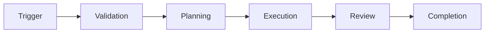

# {{Workflow Name}}

## Purpose

## Trigger

## Stages

## Agents Involved

See [[Agent Architecture]].

## Failure Recovery

See [[Workflow Engine]] failure recovery model.

## Success Criteria

---

## Navigation

- **Parent:** [[AI MOC]]
- **Related Notes:** [[Workflow Engine]] · [[Agent Architecture]]
